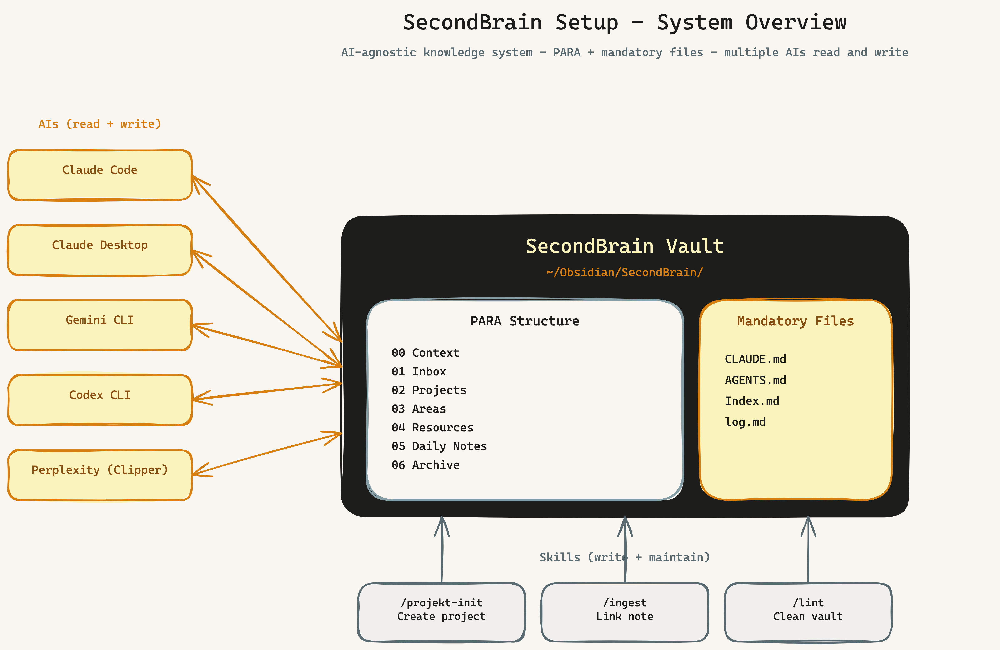
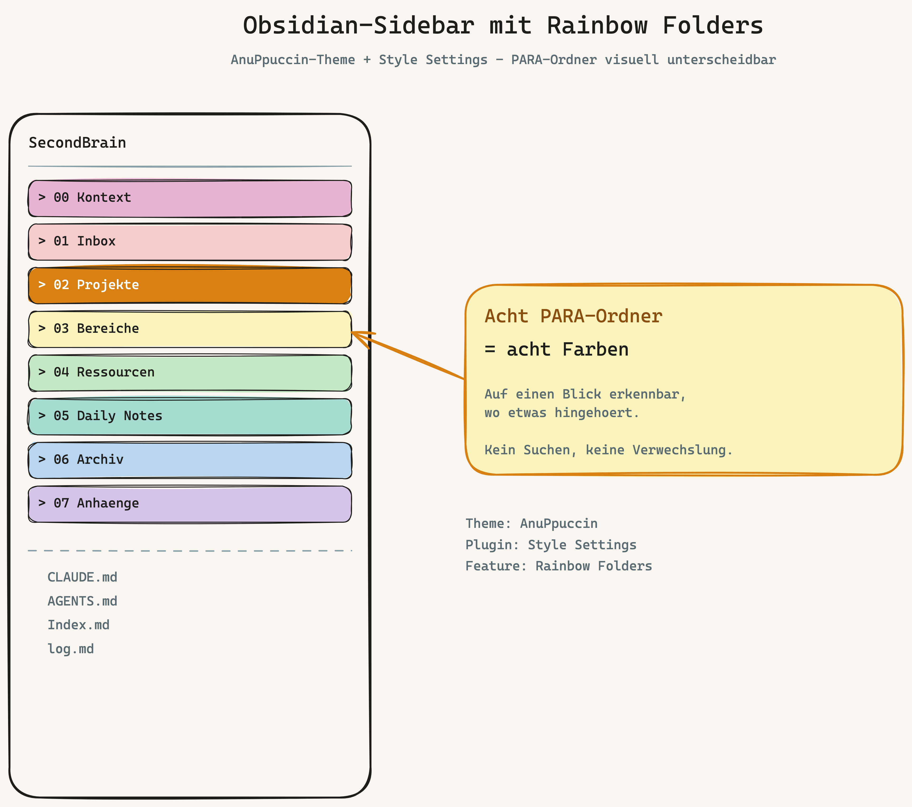
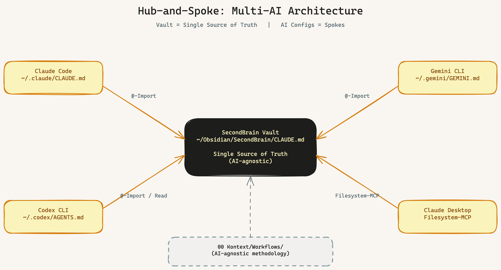
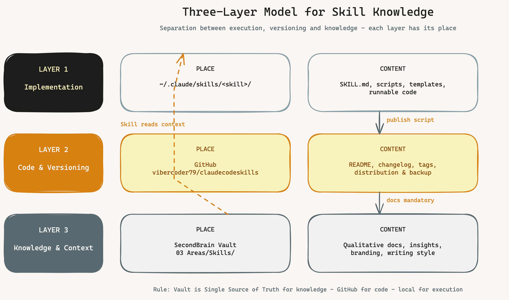
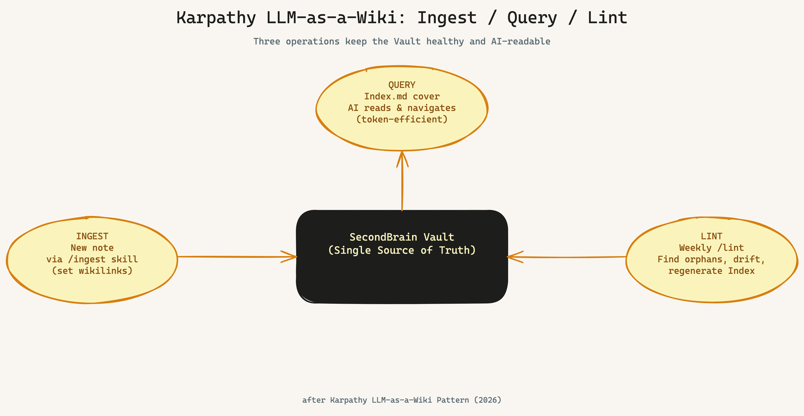

# SecondBrain Setup

🇬🇧 English · [🇩🇪 Deutsch](README.md) · [Glossary](GLOSSARY.md)

---

## In one sentence

**You create a folder of Markdown notes, and all your AIs read from and write
to the same folder.** This repo shows you how.

> A shared vault as the knowledge hub for Claude Code, Claude Desktop, Gemini
> CLI, Codex CLI and Perplexity. PARA provides the structure, Karpathy's
> [LLM-Wiki pattern](https://gist.github.com/karpathy/442a6bf555914893e9891c11519de94f)
> the liveness, three small skills the automation.



---

## Is this the right repo for me?

Three honest questions:

1. **Do you use at least two AIs in daily work?** (e.g. Claude + ChatGPT, or
   Claude + Gemini)
2. **Are you comfortable with the terminal?** (`cd`, `mkdir`, bash)
3. **Are you willing to write a note (almost) every day?**

**2 or 3 yeses** → this setup fits. **2 nos** → save your time, this isn't
for you.

If **"vault", "Markdown", "MCP" or "CLI" mean nothing to you**, read
[Chapter 00 — Prerequisites](handbook/00-prerequisites.md) first. It explains
the basics in 5 minutes.

---

## Why this repo

If you use two or more AIs seriously, sooner or later you notice: your
knowledge is scattered. Each AI is an island. Insights from one chat are
unknown in the next. No compound effect.

This setup solves that with **one central Markdown vault** as the single
source of truth. All AIs read and write there. You stay the owner of your
knowledge — no vendor database, no proprietary formats.

Inspired by:

- **Tiago Forte — Building a Second Brain (PARA)** — gives the skeleton: 4
  folder types sorted by action pressure
- **Andrej Karpathy — [LLM-as-a-Wiki](https://gist.github.com/karpathy/442a6bf555914893e9891c11519de94f)** —
  gives the liveness: Ingest/Query/Lint pattern for connected knowledge

---

## Prerequisites

| What | Required? | Note |
| ---- | --------- | ---- |
| [Obsidian](https://obsidian.md) | ✓ | free, local |
| Dataview plugin in Obsidian | ✓ | Settings → Community Plugins → Dataview |
| Terminal basics | ✓ | `cd`, `mkdir`, running bash scripts |
| At least one AI | ✓ | Claude Code, Gemini CLI, Codex CLI or Claude Desktop |
| `git` and `gh` CLI | ⚠ | only for GitHub backlog integration |
| Time for quickstart | — | 15 min if Obsidian + Claude Code already installed, 60-90 min for full new setup |

---

## Quickstart

Two paths — pick by your starting point:

- **[Path A — you already have Obsidian and Claude Code](#path-a--15-minutes)**
- **[Path B — you're starting from zero](#path-b--60-90-minutes)**

### Path A — 15 minutes

Prerequisite: Obsidian installed, Dataview plugin active, Claude Code installed.

```bash
# 1. Clone the repo
git clone https://github.com/vibercoder79/secondbrain-setup ~/Documents/GitHub/secondbrain-setup
cd ~/Documents/GitHub/secondbrain-setup

# 2. Run the setup script (interactive, idempotent)
bash setup.sh
```

The script asks for your vault path, creates PARA folders, copies templates,
and optionally installs the three skills. You decide the level of detail per
question.

**Verification:** In Claude Code in any directory, say:

```
"What's in my inbox?"
```

If Claude lists the notes from `01 Inbox/`, the connection works.

### Path B — 60-90 minutes

If you don't know Obsidian yet, want to connect multiple AIs, or are setting
up from scratch:

**Step 1: Understand the basics (10 min)**

Read [Chapter 00 — Prerequisites](handbook/00-prerequisites.md). It explains
what Obsidian, vault, Markdown, wikilinks, MCP and Dataview are.

**Step 2: Install Obsidian (10 min)**

[obsidian.md](https://obsidian.md) → Download → Open folder as vault → pick
`~/Obsidian/SecondBrain/`.

Enable plugin: Settings → Community Plugins → "Restricted mode" off →
Browse → "Dataview" → Install → Enable.

**Step 3: Vault structure and templates (5 min)**

```bash
git clone https://github.com/vibercoder79/secondbrain-setup ~/Documents/GitHub/secondbrain-setup
cd ~/Documents/GitHub/secondbrain-setup
bash setup.sh
```

Follow the interactive dialog. For global AI configs, only install the ones
you actually have tools for (e.g. Claude Code).

**Step 4: Connect AIs (15-30 min)**

One AI at a time. Guide:
[Chapter 04 — Multi-AI Setup](handbook/04-multi-ai-setup.md).

Recommended order:

1. **Claude Code** — easiest, best skill support
2. **Claude Desktop** — if you use it, configure Filesystem MCP
3. **Gemini CLI** — only if you have it installed
4. **Codex CLI** — analogous
5. **Perplexity** — no direct connection, use Obsidian Web Clipper
   (see Chapter 04)

**Step 5: Fill in your own profile (10-20 min)**

In `~/Obsidian/SecondBrain/00 Kontext/` populate with your data:

- `Über mich.md` — Who you are
- `ICP.md` — If you have customers
- `Schreibstil.md` — How you write (AIs use this for texts in your voice)
- `Branding.md` — Optional, for brand consistency

These files aren't in the repo — they are your content.

**Step 6: First note, first daily note (10 min)**

In Claude Code: `"create a new project called Test123"` — you'll be guided
through the 10-question onboarding. Result: a complete project folder.

At the end of the day: `"let's write a daily note"` — the AI proposes a
summary of the day.

---

## What does the finished vault look like?

```
~/Obsidian/SecondBrain/
├── CLAUDE.md                    ★ Single source of truth
├── AGENTS.md                    Codex mirror (optional)
├── Index.md                     ★ Vault cover (generated by /lint)
├── log.md                       Processing chronology
├── 00 Kontext/                  Your profile + workflows
├── 01 Inbox/                    Brain dumps
├── 02 Projekte/                 Active projects (with goal + end date)
│   └── My-Project/
│       ├── My-Project - PMO HUB.md
│       ├── Projekt-Governance.md
│       ├── Meetings/
│       ├── Decisions/
│       ├── Research/
│       └── assets/
├── 03 Bereiche/                 Ongoing responsibilities
├── 04 Ressourcen/               Reference material + AI chat archives
├── 05 Daily Notes/              One file per day
├── 06 Archiv/                   Completed
└── 07 Anhaenge/                 Images, PDFs
```

> Folder names stay in German because they are part of the convention — they
> sort by action pressure and AIs find them via the rules in CLAUDE.md.

**Optional: Rainbow Folders.** You can give the eight PARA folders different
colors in Obsidian's sidebar — visual orientation at a glance. Setup with the
AnuPpuccin theme + the Style Settings plugin in
[Chapter 03 — Vault structure](handbook/03-vault-structure.md#optional-rainbow-folders-visual-customization).



---

## How does it work?

### Multi-AI hub-and-spoke

A **vault `CLAUDE.md`** at the root of the Obsidian vault is the
[single source of truth](GLOSSARY.md#ssot-single-source-of-truth). All AI
configs reference it via [`@-import`](GLOSSARY.md#-import) or
[Filesystem MCP](GLOSSARY.md#mcp-model-context-protocol). Every AI reads the
same rules and writes into the same vault.



### Three layers for skill knowledge

[Skills](GLOSSARY.md#skill-claude-code-skill) (code/implementation), GitHub
(versioning) and the SecondBrain (knowledge/context) stay separated — the
SecondBrain is the single source of truth for knowledge, not the skill folder.



### Karpathy's LLM-as-a-Wiki pattern in practice

Three operations keep the vault alive: **Ingest** processes new notes (sets
[wikilinks](GLOSSARY.md#wikilink), enriches
[synthesis pages](GLOSSARY.md#synthesis-page)), **Query** uses the vault as
context, **Lint** checks health and regenerates the vault cover.



All diagrams as Excalidraw source in [`diagramme/`](diagramme/).

---

## Handbook

Eight chapters, 5-15 minutes each:

0. [Prerequisites — What you should know first](handbook/00-prerequisites.md) *(for beginners)*
1. [Philosophy — Why this setup exists](handbook/01-philosophy.md)
2. [Architecture — Hub-and-spoke and the three-layer model](handbook/02-architecture.md)
3. [Vault structure — PARA in practice](handbook/03-vault-structure.md)
4. [Multi-AI setup — Claude, Gemini, Codex, Claude Desktop, Perplexity](handbook/04-multi-ai-setup.md)
5. [Workflows — Daily notes, projects, deep research, ingest, lint](handbook/05-workflows.md)
6. [Skills — projekt-init, lint, ingest in detail](handbook/06-skills.md)
7. [Customizing — Your own paths, your own tools, migration](handbook/07-customizing.md)

Plus: [Glossary](GLOSSARY.md) with all technical terms.

---

## Repo structure

```
secondbrain-setup/
├── README.md, README.en.md        Quickstart in DE + EN
├── GLOSSAR.md, GLOSSARY.md        Glossaries DE + EN
├── handbuch/                       Depth (DE, 8 chapters incl. Ch. 00)
├── handbook/                       Depth (EN, 8 chapters incl. Ch. 00)
├── templates/
│   ├── claude/CLAUDE.md            Global Claude Code config
│   ├── codex/AGENTS.md             Global Codex CLI config
│   ├── gemini/GEMINI.md            Global Gemini CLI config
│   ├── claude-desktop/             Claude Desktop config + README
│   ├── vault/                      Vault content (CLAUDE.md, AGENTS.md, 00 Kontext)
│   └── projekt/                    Project templates (PMO HUB, Governance, ADR, Meeting)
├── skills/                         Three skills: projekt-init, lint, ingest
├── diagramme/                      Excalidraw + PNG (DE + EN)
└── setup.sh                        Interactive setup helper
```

---

## Security notes

- **No API keys in the repo.** All templates use placeholders
  (`YOUR_API_KEY_HERE`). Use Keychain/env vars for real secrets.
- **Paths are sanitized** to `~/...` — no absolute userland paths.
- **Vault contents are generic** — no personal data, no example projects with
  customer names.

Before pushing your own changes: `git diff --staged` and check for your own
secrets.

---

## Who doesn't need this

- People who use a single AI and are happy with it
- People without recurring projects
- People for whom "Memory" in the AI app is enough

But if you use two or more AIs seriously and feel your knowledge is
scattered — this setup solves that.

---

## License

MIT — see [LICENSE](LICENSE).

## Contributing

Issues and pull requests welcome. For larger changes, open an issue first
so we can align on direction.

## Inspiration & sources

- [Andrej Karpathy — LLM-as-a-Wiki gist](https://gist.github.com/karpathy/442a6bf555914893e9891c11519de94f)
- Tiago Forte — Building a Second Brain (book, 2022)
- Michael Nygard — [Documenting Architecture Decisions (ADR)](https://www.cognitect.com/blog/2011/11/15/documenting-architecture-decisions) (2011)
- Vault-centric skills inspired by the [OpenCLAW Bootstrap pattern](https://github.com/vibercoder79/KI-Masterclass-Koerting-/tree/main/bootstrap)
