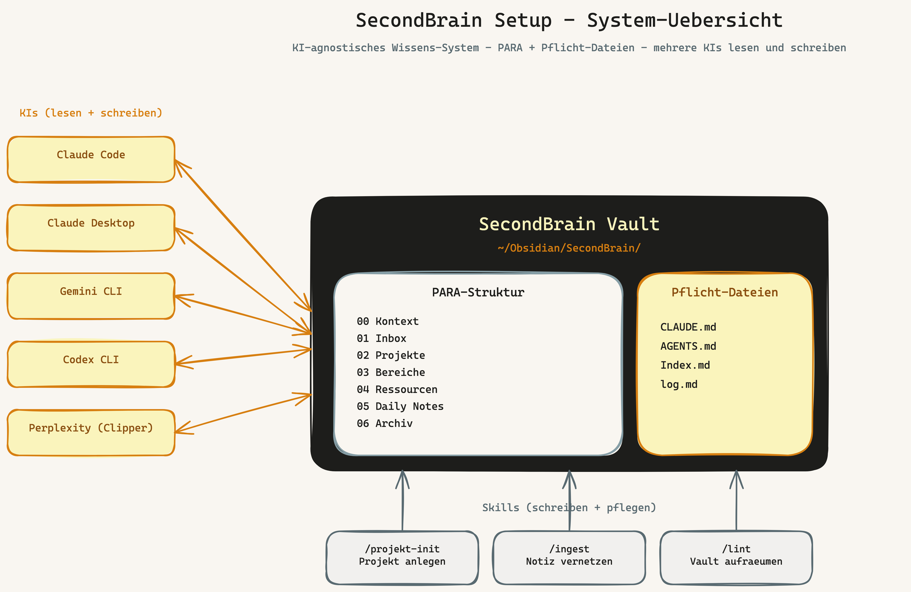
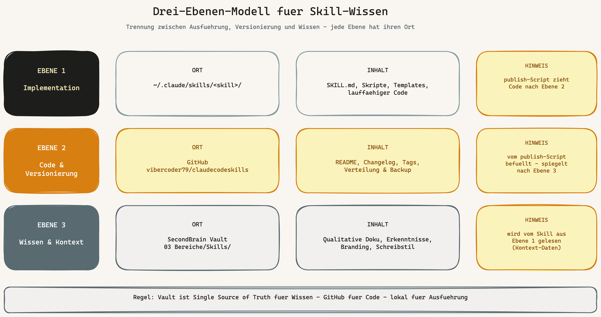

# SecondBrain Setup

🇩🇪 Deutsch · [🇬🇧 English](README.en.md) · [Glossar](GLOSSAR.md)

---

## In einem Satz

**Du legst einen Ordner mit Markdown-Notizen an, und alle deine KIs lesen und
schreiben in denselben Ordner.** Dieses Repo zeigt dir wie.

> Ein gemeinsames Vault als Wissens-Hub fuer Claude Code, Claude Desktop, Gemini
> CLI, Codex CLI und Perplexity. PARA gibt die Ordnung, Karpathys
> [LLM-Wiki-Pattern](https://gist.github.com/karpathy/442a6bf555914893e9891c11519de94f)
> die Lebendigkeit, drei kleine Skills die Automation.



---

## Habe ich das richtige Repo?

Drei Fragen, ehrlich:

1. **Nutzt du mindestens zwei KIs im Alltag?** (z.B. Claude + ChatGPT, oder
   Claude + Gemini)
2. **Bist du komfortabel mit dem Terminal?** (`cd`, `mkdir`, bash)
3. **Bist du bereit, (fast) taeglich eine Notiz zu schreiben?**

**2x oder 3x Ja** → dieses Setup passt. **2x Nein** → spar dir die Zeit, das
Setup ist nichts fuer dich.

Wenn du **mit "Vault", "Markdown", "MCP" oder "CLI" nichts anfangen kannst**,
lies zuerst [Kapitel 00 — Vorab](handbuch/00-vorab.md). Das erklaert die
Grundbegriffe in 5 Minuten.

---

## Was ist ueberhaupt ein Second Brain?

Der Begriff stammt aus dem Buch "Building a Second Brain" (Tiago Forte, 2022).
Die Kernidee: dein Gehirn ist gut darin **Ideen zu haben**, aber schlecht darin
sie **zu behalten und zu vernetzen**. Ein Second Brain ist ein externes
Wissens-System — Notizen, Strukturen, Querverweise — das dir den
Erinnerungsaufwand abnimmt. Du wirfst Gedanken rein, sortierst sie strukturiert
und findest sie wieder, wenn du sie brauchst. Im Idealfall verdichtet sich das
Wissen ueber die Zeit zu mehr als der Summe seiner Teile.

Es gibt **viele Wege**, ein Second Brain zu bauen:

- **Notion**, **Roam Research**, **Logseq**, **Capacities** — fertige Apps
  mit Datenbank-Charakter
- **Obsidian** + Markdown — lokal, vendor-frei, plugin-basiert
- **Apple Notes**, **Google Keep**, einfache Notiz-Apps fuer Minimalisten
- **Tana**, **Mem**, **Reflect** — KI-native Loesungen mit eingebauten LLMs
- **Plain text** in einem Git-Repo — fuer Hardcore-Puristen
- Hybrid-Setups die das alles kombinieren

**Dieses Repo zeigt EINES dieser Setups.** Es ist nicht "die einzig wahre"
Loesung — es ist die Loesung, die fuer mehrere KIs gleichzeitig optimiert ist
und maschinenlesbar bleibt. Wenn dir ein anderer Ansatz besser passt: nimm
den. Wichtiger als das Tool ist, dass du **ueberhaupt eines** baust und es
regelmaessig pflegst.

Was dieses Setup besonders macht, beschreibt der naechste Abschnitt.

---

## Warum dieses Repo

Wenn du zwei oder mehr KIs ernsthaft im Alltag nutzt, merkst du irgendwann:
dein Wissen liegt verstreut. Jede KI ist eine Insel. Erkenntnisse aus dem
einen Chat sind im naechsten unbekannt. Kein Compound-Effekt.

Dieses Setup loest das mit **einem zentralen Markdown-Vault** als Single
Source of Truth. Alle KIs lesen und schreiben dort. Du bleibst Eigner deines
Wissens — keine Vendor-Datenbank, keine proprietaeren Formate.

Inspiriert von:

- **Tiago Forte — Building a Second Brain (PARA)** — gibt das Skelett: 4
  Ordner-Typen sortiert nach Handlungsdruck
- **Andrej Karpathy — [LLM-as-a-Wiki](https://gist.github.com/karpathy/442a6bf555914893e9891c11519de94f)** —
  gibt die Lebendigkeit: Ingest/Query/Lint-Pattern fuer vernetztes Wissen

---

## Voraussetzungen

| Was | Pflicht? | Anmerkung |
| --- | -------- | --------- |
| [Obsidian](https://obsidian.md) | ✓ | kostenlos, lokal |
| Dataview-Plugin in Obsidian | ✓ | Settings → Community Plugins → Dataview |
| Terminal-Grundlagen | ✓ | `cd`, `mkdir`, bash-Skripte ausfuehren |
| Mindestens eine KI | ✓ | Claude Code, Gemini CLI, Codex CLI oder Claude Desktop |
| `git` und `gh` CLI | ⚠ | nur fuer GitHub-Backlog-Integration |
| Zeit fuer Quickstart | — | 15 Min wenn Obsidian + Claude Code vorhanden, 60-90 Min fuer komplettes Neu-Setup |

---

## Quickstart

Es gibt zwei Pfade — waehle nach deinem Stand:

- **[Pfad A — du hast schon Obsidian und Claude Code](#pfad-a--15-minuten)**
- **[Pfad B — du faengst bei Null an](#pfad-b--60-90-minuten)**

### Pfad A — 15 Minuten

Voraussetzung: Obsidian installiert, Dataview-Plugin aktiv, Claude Code
installiert.

```bash
# 1. Repo clonen
git clone https://github.com/vibercoder79/secondbrain-setup ~/Documents/GitHub/secondbrain-setup
cd ~/Documents/GitHub/secondbrain-setup

# 2. Setup-Script starten (interaktiv, idempotent)
bash setup.sh
```

Das Script fragt nach deinem Vault-Pfad, legt PARA-Ordner an, kopiert
Templates und installiert auf Wunsch die drei Skills. Detailgrad kannst du pro
Frage entscheiden.

**Verifikation:** In Claude Code in einem beliebigen Verzeichnis sagen:

```
"Was steht in meiner Inbox?"
```

Wenn Claude die Notizen aus `01 Inbox/` listet, funktioniert die Anbindung.

### Pfad B — 60-90 Minuten

Wenn du Obsidian noch nicht kennst, mehrere KIs verbinden willst, oder ein
komplett neues Setup aufsetzt:

**Schritt 1: Grundlagen verstehen (10 Min)**

Lies [Kapitel 00 — Vorab](handbuch/00-vorab.md). Es erklaert was Obsidian,
Vault, Markdown, Wikilinks, MCP und Dataview sind.

**Schritt 2: Obsidian installieren (10 Min)**

[obsidian.md](https://obsidian.md) → Download → Open folder as vault →
`~/Obsidian/SecondBrain/` waehlen.

Plugin aktivieren: Settings → Community Plugins → "Restricted mode" off →
Browse → "Dataview" → Install → Enable.

**Schritt 3: Vault-Struktur und Templates (5 Min)**

```bash
git clone https://github.com/vibercoder79/secondbrain-setup ~/Documents/GitHub/secondbrain-setup
cd ~/Documents/GitHub/secondbrain-setup
bash setup.sh
```

Folge dem interaktiven Dialog. Bei den globalen KI-Configs nur die installieren
fuer die du Tools hast (z.B. Claude Code).

**Schritt 4: KIs anschliessen (15-30 Min)**

Eine KI nach der anderen. Anleitung:
[Kapitel 04 — Multi-KI-Setup](handbuch/04-multi-ki-setup.md).

Reihenfolge-Empfehlung:

1. **Claude Code** — am einfachsten, beste Skill-Unterstuetzung
2. **Claude Desktop** — wenn du das nutzt, Filesystem-MCP konfigurieren
3. **Gemini CLI** — nur wenn du es installiert hast
4. **Codex CLI** — analog
5. **Perplexity** — kein direkter Anschluss, ueber Obsidian Web Clipper
   (siehe Kapitel 04)

**Schritt 5: Eigenes Profil eintragen (10-20 Min)**

In `~/Obsidian/SecondBrain/00 Kontext/` mit deinen Daten befuellen:

- `Über mich.md` — Wer bist du
- `ICP.md` — Wenn du Kunden hast
- `Schreibstil.md` — Wie du schreibst (KIs nutzen das fuer Texte in deinem Ton)
- `Branding.md` — Optional, fuer Marken-Konsistenz

Diese Dateien sind nicht im Repo enthalten — sie sind dein Inhalt.

**Schritt 6: Erste Notiz, erste Daily Note (10 Min)**

In Claude Code: `"lege ein Projekt fuer Test123 an"` — du wirst durch das
10-Fragen-Onboarding gefuehrt. Ergebnis: ein vollstaendiger Projekt-Ordner.

Am Tagesende: `"lass uns eine Daily Note schreiben"` — die KI schlaegt eine
Zusammenfassung des Tages vor.

---

## Wie sieht das fertige Vault aus?

```
~/Obsidian/SecondBrain/
├── CLAUDE.md                    ★ Single Source of Truth
├── AGENTS.md                    Codex-Spiegel (optional)
├── Index.md                     ★ Vault-Cover (von /lint generiert)
├── log.md                       Verarbeitungs-Chronologie
├── 00 Kontext/                  Dein Profil + Workflows
├── 01 Inbox/                    Brain Dumps
├── 02 Projekte/                 Aktive Projekte (mit Ziel + Enddatum)
│   └── Mein-Projekt/
│       ├── Mein-Projekt - PMO HUB.md
│       ├── Projekt-Governance.md
│       ├── Meetings/
│       ├── Decisions/
│       ├── Research/
│       └── assets/
├── 03 Bereiche/                 Laufende Verantwortungen
├── 04 Ressourcen/               Referenzmaterial + KI-Chat-Archive
├── 05 Daily Notes/              Eine Datei pro Tag
├── 06 Archiv/                   Abgeschlossen
└── 07 Anhaenge/                 Bilder, PDFs
```

**Optional: Rainbow Folders.** Du kannst die acht PARA-Ordner in Obsidians
Sidebar farblich unterscheiden — visuelle Orientierung auf einen Blick.
Setup mit AnuPpuccin-Theme + Style-Settings-Plugin in
[Kapitel 03 — Vault-Struktur](handbuch/03-vault-struktur.md#optional-rainbow-folders-visuelle-anpassung).


---

## Wie funktioniert das?

### Multi-KI Hub-and-Spoke

Eine **Vault-CLAUDE.md** im Wurzel des Obsidian-Vaults ist die [Single Source
of Truth](GLOSSAR.md#ssot-single-source-of-truth). Alle KI-Configs verweisen
darauf via [`@-Import`](GLOSSAR.md#-import) oder [Filesystem-MCP](GLOSSAR.md#mcp-model-context-protocol).
So liest jede KI dieselben Regeln und schreibt in dasselbe Vault.


### Drei Ebenen fuer Skill-Wissen

[Skills](GLOSSAR.md#skill-claude-code-skill) (Code/Implementation), GitHub
(Versionierung) und das SecondBrain (Wissen/Kontext) bleiben getrennt — das
SecondBrain ist die Single Source of Truth fuer Wissen, nicht der Skill-Ordner.



### Karpathys LLM-Wiki-Pattern in Praxis

Drei Operationen halten das Vault lebendig: **Ingest** verarbeitet neue Notizen
(setzt [Wikilinks](GLOSSAR.md#wikilink), erweitert
[Synthese-Seiten](GLOSSAR.md#synthese-seite)), **Query** nutzt das Vault als
Kontext, **Lint** prueft Gesundheit und regeneriert das Vault-Cover.


Alle Diagramme als Excalidraw-Quelle in [`diagramme/`](diagramme/).

---

## Handbuch

Sieben Kapitel, jeweils 5-15 Minuten Lesedauer:

0. [Vorab — Was du vorher wissen solltest](handbuch/00-vorab.md) *(fuer Beginner)*
1. [Philosophie — Warum dieses Setup existiert](handbuch/01-philosophie.md)
2. [Architektur — Hub-and-Spoke und das Drei-Ebenen-Modell](handbuch/02-architektur.md)
3. [Vault-Struktur — PARA in Praxis](handbuch/03-vault-struktur.md)
4. [Multi-KI-Setup — Claude, Gemini, Codex, Claude Desktop, Perplexity](handbuch/04-multi-ki-setup.md)
5. [Workflows — Daily Notes, Projekte, Deep Research, Ingest, Lint](handbuch/05-workflows.md)
6. [Skills — projekt-init, lint, ingest im Detail](handbuch/06-skills.md)
7. [Anpassen — Eigene Pfade, eigene Tools, Migration](handbuch/07-anpassen.md)

Plus: [Glossar](GLOSSAR.md) mit allen Fachbegriffen.

---

## Repo-Struktur

```
secondbrain-setup/
├── README.md, README.en.md        Quickstart in DE + EN
├── GLOSSAR.md, GLOSSARY.md        Begriffsdefinitionen DE + EN
├── handbuch/                       Tiefe (DE, 8 Kapitel inkl. Kap. 00)
├── handbook/                       Tiefe (EN, 8 Chapter inkl. Kap. 00)
├── templates/
│   ├── claude/CLAUDE.md            Globale Claude Code Config
│   ├── codex/AGENTS.md             Globale Codex CLI Config
│   ├── gemini/GEMINI.md            Globale Gemini CLI Config
│   ├── claude-desktop/             Claude Desktop Config + README
│   ├── vault/                      Vault-Inhalte (CLAUDE.md, AGENTS.md, 00 Kontext)
│   └── projekt/                    Projekt-Templates (PMO HUB, Governance, ADR, Meeting)
├── skills/                         Drei Skills: projekt-init, lint, ingest
├── diagramme/                      Excalidraw + PNG (DE + EN)
└── setup.sh                        Interaktiver Setup-Helfer
```

---

## Sicherheitshinweise

- **Keine API-Keys im Repo.** Alle Templates nutzen Platzhalter
  (`YOUR_API_KEY_HERE`). Verwende Keychain/env-vars fuer echte Secrets.
- **Pfade sind sanitisiert** auf `~/...` — keine absoluten Userland-Pfade.
- **Vault-Inhalte sind generisch** — keine personenbezogenen Daten, keine
  Beispielprojekte mit Kundennamen.

Vor jedem eigenen Push: `git diff --staged` lesen und auf eigene Secrets pruefen.

---

## Wer das nicht braucht

- Wer nur eine einzige KI nutzt und damit zufrieden ist
- Wer keine wiederkehrenden Projekte hat
- Wer "Memory" in der KI-App ausreicht

Wenn du aber zwei oder mehr KIs ernsthaft im Alltag nutzt und merkst, dass
dein Wissen verstreut liegt — dieses Setup loest das.

---

## Lizenz

MIT — siehe [LICENSE](LICENSE).

## Beitragen

Issues und Pull Requests willkommen. Bei groesseren Aenderungen vorher ein
Issue oeffnen, damit wir die Richtung abstimmen koennen.

## Inspiration & Quellen

Dieses Setup ist nicht aus dem Nichts entstanden — es baut auf mehreren Vorarbeiten auf, und hat zwei eigene Erweiterungen.

**Ausgangspunkt — Obsidian-Vault mit PARA:**

- **Tiago Forte — Building a Second Brain** (Buch, 2022) — das PARA-Konzept als
  Skelett der Ordnerstruktur
- **Julian Ivanov — [Obsidian Setup Tour (YouTube)](https://www.youtube.com/watch?v=NVUCQ-pzBn4)** —
  konkrete Inspiration fuer die Praxis-Umsetzung der PARA-Methode in Obsidian.
  Tobias' Setup orientiert sich strukturell an Julians Vault — mit Anpassungen
  fuer die Multi-KI-Nutzung.

**Schritt weiter — Maschinenlesbarkeit und Compound-Effekt:**

- **Andrej Karpathy — [LLM-as-a-Wiki Gist](https://gist.github.com/karpathy/442a6bf555914893e9891c11519de94f)** —
  zweiter Layer: das Vault nicht nur als menschen-lesbares Notizsystem
  betrachten, sondern als LLM-lesbares Wiki, das von KIs inkrementell gepflegt
  wird. Karpathys Ingest/Query/Lint-Pattern hebt das Setup von einem reinen
  Ablage-System zu einem aktiven Wissens-System.

**Eigene Erweiterung — die zwei Pflege-Skills:**

- **`/ingest`** — verarbeitet neue Notizen, setzt bidirektionale Wikilinks,
  erweitert Synthese-Seiten. Implementiert Karpathys "Ingest"-Operation in der
  Praxis.
- **`/lint`** — woechentlicher Health-Check des Vaults, regeneriert die
  `Index.md` als Vault-Cover. Implementiert Karpathys "Lint"-Operation, plus
  Projekt-Compliance-Checks.

Diese zwei Skills (siehe [`skills/`](skills/)) sind die Brueche zwischen einem
**statischen Notizsystem** (was Julian und Forte beschreiben) und einem
**lebendigen Wissens-Wiki** (was Karpathy postuliert).

**Weitere Quellen:**

- Michael Nygard — [Documenting Architecture Decisions (ADR)](https://www.cognitect.com/blog/2011/11/15/documenting-architecture-decisions) (2011) — fuer den ADR-Workflow in Projekten
- Vault-zentrische Skills inspiriert vom [OpenCLAW Bootstrap-Pattern](https://github.com/vibercoder79/KI-Masterclass-Koerting-/tree/main/bootstrap) — Bootstrap-Pattern fuer Code-Repos, hier adaptiert fuer Notizsysteme
