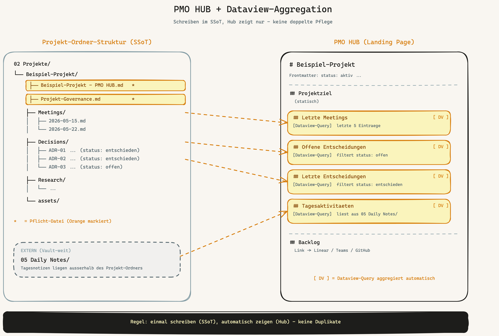
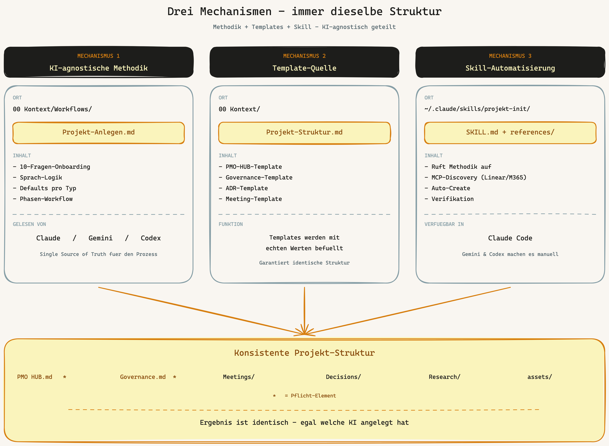

# 08 — Projektmanagement: Hub, Governance, Dataview-Aggregation

> Kurzfassung: Jedes Projekt ist ein Ordner mit fester Struktur. Eine
> PMO-HUB-Datei ist die Landing Page und zeigt Live-Sichten via Dataview-Queries.
> Eine Governance-Datei definiert den Tool-Stack. Methodik liegt KI-agnostisch
> in `00 Kontext/Workflows/Projekt-Anlegen.md` — alle KIs nutzen sie, und der
> `/projekt-init`-Skill automatisiert sie fuer Claude Code.

## Grundsatz: Obsidian = Wissen, Backlog-Tool = Arbeit

Eine harte Trennung haelt das System gesund:

- **Obsidian** haelt **Wissen**: Meetings, Decisions (ADRs), Research,
  Tagesaktivitaeten, qualitative Doku, Stakeholder-Kontext.
- **Backlog-Tool** (Linear, Teams-Kanban, GitHub Issues, Asana, ClickUp, ...)
  haelt **Arbeit**: Tasks, User Stories, Sprints, Bugs, Tickets mit IDs und
  Statuswerten.

Tasks in Obsidian zu fuehren ist verlockend (alles an einem Ort), aber:

- Du verlierst die Kanban/Sprint-Sichten des Backlog-Tools
- Du dopplest, wenn das Backlog-Tool sowieso aufgesetzt ist
- Andere Teammitglieder ohne Obsidian-Zugang sehen die Tasks nicht

Die Regel ist also: **Tasks gehen ins Backlog-Tool. Obsidian zeigt darauf, dass
sie existieren — und wer sich dafuer interessiert, klickt durch.**

Ausnahme: wenn das Projekt komplett solo und kein Backlog-Tool noetig ist,
gibt es im Hub eine "Pre-Backlog Action Items"-Sektion mit Checkboxen direkt
im Markdown. Sobald das Projekt wachsen will: Backlog-Tool aktivieren.

## Projekt ist immer ein Ordner

Keine Einzeldatei-Projekte. Jedes Projekt bekommt sofort einen Ordner mit
Pflicht-Struktur:

```
02 Projekte/<Projekt-Name>/
├── <Projekt-Name> - PMO HUB.md   ★ Landing Page (Pflicht)
├── Projekt-Governance.md          ★ Tool-Stack (Pflicht)
├── Meetings/                      Eine Datei pro Meeting
├── Decisions/                     ADRs — eine Datei pro Entscheidung
├── Research/                      Projektbezogene Recherche
├── assets/                        Diagramme, Anhaenge
├── Risks/                         (Opt-in via risk_register: enabled)
└── Financials.md                  (Opt-in via financials_tool)
```

**Warum Pflicht-Struktur?**

- Konsistenz: jeder im Team weiss wo etwas liegt
- Wikilink-Stabilitaet: `[[<Projekt> - PMO HUB]]` funktioniert ueberall im Vault
- Dataview-Queries: zaehlen auf konsistente Pfade
- `/lint` kann Drift erkennen und korrigieren

**Was im Wurzel des Projekt-Ordners verboten ist:**

- `README.md` — der PMO HUB ist die Landing Page
- Lose Notizen — gehoeren in einen Sub-Ordner (`Research/`, `Meetings/`, etc.)
- Andere Datei-Typen ausser den oben gelisteten

`/lint` markiert solche Verstoesse als Whitelist-Errors.

## PMO HUB — die Landing Page

Der Hub ist die **eine Datei**, die das ganze Projekt zusammenfasst. Wer das
Projekt verstehen will, liest den Hub. Wer arbeitet, navigiert vom Hub aus.

### Pflicht-Frontmatter

```yaml
---
tags: [projekt]
status: aktiv               # aktiv | abgeschlossen | pausiert
phase: konzeption           # konzeption | umsetzung | produktion | wartung
erstellt: 2026-05-21
aktualisiert: 2026-05-21
source: claude
chat_url: https://claude.ai/chat/...
governance: "[[Projekt-Governance]]"
related: []
---
```

Werte wie `status` und `phase` sind Single Source of Truth — die `Index.md`
(Vault-Cover) zieht aus genau diesem Frontmatter ihre Anzeige.

### Sektionen im Hub

Ein typischer Hub hat diese Sektionen:

```markdown
# <Projekt-Name>

> Ein-Satz-Beschreibung des Projekts.

## Projektziel
Konkretes Ziel, gewuenschter Endzustand.

## Stakeholder
- Owner: @Person
- Beteiligte: @Person, @Person
- Kunde: <intern | extern>

## Stack
(Nur bei Software-Projekten: verwendete Sprachen, Frameworks, Services)

## Tagesaktivitaeten
(Dataview-Query — aggregiert Daily Notes mit Projekt-Tag, siehe unten)

## Offene Entscheidungen
(Dataview-Query auf Decisions/ mit status: offen)

## Letzte Entscheidungen
(Dataview-Query auf Decisions/ mit status: entschieden, LIMIT 5)

## Components / Komponenten
(Nur bei Software: Wikilinks zu Komponenten-Notizen in Components/)

## Backlog
Link zum Backlog-Tool ODER "Pre-Backlog Action Items" wenn `backlog_tool: none`

## Meetings
(Dataview-Query auf Meetings/ — neueste zuerst)

## Research
Manuelle Verweise auf wichtige Research-Notizen in Research/
```

Der Hub ist **Anzeige, nicht Speicher**. Die Daten leben in den Unterordnern
(Daily Notes, Decisions, Meetings) — der Hub aggregiert sie.

## Dataview-Aggregation — der Trick



Das ist das Herzstueck. Statt im Hub manuell Listen zu pflegen, ziehen
**Dataview-Queries** Daten live aus den Unterordnern:

### Tagesaktivitaeten aus Daily Notes

````markdown
## Tagesaktivitaeten

```dataview
LIST file.link
FROM "05 Daily Notes"
WHERE contains(file.tags, "#mein-projekt-tag")
SORT file.name DESC
LIMIT 30
```
````

Du schreibst in `05 Daily Notes/2026-05-21.md` eine Sektion
`## Mein-Projekt #mein-projekt-tag` — der Hub zeigt diese Daily Note
automatisch. Keine doppelte Pflege.

### Offene Entscheidungen aus Decisions/

````markdown
## Offene Entscheidungen

```dataview
TABLE WITHOUT ID file.link AS "Entscheidung", erstellt
FROM "02 Projekte/<Projekt-Name>/Decisions"
WHERE status = "offen"
SORT erstellt DESC
```
````

Du legst in `Decisions/ADR-05 Datenbank-Wahl.md` ein neues ADR mit
`status: offen` an — der Hub zeigt es sofort.

### Letzte entschiedene ADRs

````markdown
## Letzte Entscheidungen

```dataview
TABLE WITHOUT ID file.link AS "Entscheidung", entschieden_am
FROM "02 Projekte/<Projekt-Name>/Decisions"
WHERE status = "entschieden"
SORT entschieden_am DESC
LIMIT 5
```
````

Sobald ein ADR auf `status: entschieden` gesetzt wird, wandert es von der
oberen in die untere Sektion. Visualisierter Workflow-State ohne Code.

## Decisions als ADRs

ADR = Architecture Decision Record. Eine Markdown-Datei pro wichtigem
Entscheid in `Decisions/`. Pattern stammt von Michael Nygard (2011), urspruenglich
fuer Software-Architektur — funktioniert genauso fuer Beratungs-, Marketing-
und Persoenliche Projekte.

### ADR-Struktur

```yaml
---
type: entscheidung
status: offen           # offen | entschieden | verworfen
erstellt: 2026-05-21
entschieden_am: 2026-05-25
adr_nr: 5
tags: [projekt, mein-projekt-tag, decision]
---

# ADR-05: Datenbank-Wahl

## Kontext
Was ist die Situation? Welcher Druck/Constraint?

## Optionen
- A: PostgreSQL — bekannt, robust, mehr Ops-Overhead
- B: SQLite — einfacher, ausreichend fuer aktuellen Scale
- C: Supabase — Managed, schneller Start, Vendor-Lock-in

## Entscheidung
Option B (SQLite).

## Begruendung
Aktueller Scale rechtfertigt keine Server-DB. SQLite reicht fuer 100k Rows.
Migration nach PostgreSQL bleibt moeglich.

## Konsequenzen
- Backups: tagsueber stuendlich, nachts taeglich
- Multi-Writer-Constraint: nur ein Service schreibt
- Migrations-Path: in 6 Monaten neu bewerten
```

### Warum ADRs?

- **Spaetere Lesbarkeit**: in 6 Monaten verstehst du noch, *warum* du was entschieden hast
- **Onboarding**: neue Teammitglieder verstehen den Stack ohne Archaeologie
- **Compound-Effekt**: Du erkennst Muster ueber Projekte hinweg (welche Decisions wiederholst du?)
- **`/lint` prueft Konsistenz**: status ↔ entschieden_am, kein offen ohne erstellt

## Projekt-Governance — der Tool-Stack pro Projekt

Pflicht-Datei pro Projekt: `Projekt-Governance.md`. Sie definiert das **Wer
arbeitet wo** fuer dieses Projekt.

```yaml
---
type: governance
tags: [projekt, mein-projekt-tag, governance]
erstellt: 2026-05-21
aktualisiert: 2026-05-21
---

# Projekt-Governance

## Tool-Stack

| Disziplin | Tool | Pfad / URL |
| --------- | ---- | ---------- |
| Wissen / Doku | Obsidian | `02 Projekte/<Projekt-Name>/` |
| Backlog | Linear | https://linear.app/owlist/project/abc |
| Code | GitHub | https://github.com/vibercoder79/mein-repo |
| Code-Reviews | GitHub PRs | (siehe Repo) |
| Communication | Slack / Teams | #mein-projekt |

## Backlog-Konvention

- **Tool:** Linear
- **URL:** https://linear.app/owlist/project/abc
- **Filter:** `project:mein-projekt AND state != "Done"`
- **ID-Praefix:** `MP-` (z.B. `MP-42`)
- **Labels:** `meeting-action`, `decision`, `risk-mitigation`

## Risk-Tracking
risk_register: disabled    # disabled | enabled

## Financials
financials_tool: none      # none | excel | sheets | quickbooks
financials_url: —
```

### Warum ist das wichtig?

- **Pro Projekt unterschiedliche Tools moeglich**: Kunde A nutzt Linear,
  Kunde B Teams-Kanban, internes Projekt nur Pre-Backlog
- **KIs lesen die Governance vor Backlog-Aktionen**: bevor Claude eine Task
  anlegt, schaut sie nach welches Tool wofuer steht
- **`/lint` prueft Konsistenz**: jedes Projekt hat eine Governance, fehlende
  oder leere Governance ist ein Compliance-Verstoss

## Wie immer dieselbe Struktur entsteht



Drei Mechanismen sorgen dafuer dass Projekte ueberall gleich aussehen:

### 1. KI-agnostische Methodik

`00 Kontext/Workflows/Projekt-Anlegen.md` ist die Single Source of Truth fuer
den Projekt-Anlage-Workflow. Sie enthaelt:

- Den **10-Fragen-Block** (Sprache + 9 Onboarding-Fragen)
- Die **Sprach-Logik** (DE/EN)
- **Defaults pro Projekt-Typ** (Software → Linear, Beratung → Teams-Kanban, etc.)
- **Frontmatter-Schemas**
- **Phasen-Workflow** (Validierung → Backlog → Ordner → Templates → Verifikation)

Alle KIs lesen diese Datei und fahren denselben Workflow. Claude, Gemini,
Codex — Ergebnis ist identisch, weil Methodik identisch.

### 2. Template-Quelle

`00 Kontext/Projekt-Struktur.md` enthaelt die **Templates** als Code-Bloecke:
PMO-HUB-Template, Governance-Template, ADR-Template, Meeting-Template,
Risk-Template, Financials-Template. Die KI liest die Datei und kopiert die
relevanten Bloecke in den neuen Projekt-Ordner, **mit echten Werten** statt
Platzhaltern.

Aenderst du das Template hier, aendert sich es fuer **alle zukuenftigen
Projekte**. Bestehende Projekte muessen manuell nachgezogen werden.

### 3. Skill-Automatisierung

`/projekt-init` (siehe [Kapitel 06](06-skills.md)) automatisiert den Workflow
fuer Claude Code:

- Stellt die 10 Fragen als Block
- Macht **MCP-Discovery** fuer Backlog-Tools (Linear, M365 Teams-Kanban) wenn
  konfiguriert
- Legt Ordnerstruktur an
- Befuellt Templates mit echten Werten
- Verifiziert Whitelist und Pflicht-Dateien

Gemini und Codex haben keinen Skill — sie machen es manuell anhand der
Methodik aus `Projekt-Anlegen.md`. Das Ergebnis ist gleich, der Weg dorthin
unterscheidet sich.

## Container-Pattern fuer Kunden-Gruppen

Wenn du **mehrere Projekte fuer denselben Kunden** hast, gibt es das
Container-Pattern:

```
02 Projekte/
├── _KUNDEN-A/                     ← Container (Praefix _)
│   ├── 2026-04-15 Website-Redesign/
│   ├── 2026-05-01 SEO-Audit/
│   └── 2026-06-10 Email-Kampagne/
├── _INTERN/                       ← Container fuer interne Projekte
│   ├── Newsletter Q3/
│   └── Buchhaltung 2026/
└── Eigenstaendiges-Projekt/       ← Standard-Projekt
```

**Eigenschaften eines Containers:**

- **Praefix `_`** im Ordnernamen — vom Lint erkannt als Container
- **Kein PMO HUB** im Container-Wurzel — nur Sub-Projekte
- **Keine Governance** — jedes Sub-Projekt hat seine eigene
- **Bricht keine Compliance-Regeln** — `/lint` ueberspringt Container-Pruefung
  fuer die Wurzel und prueft nur die Sub-Projekte einzeln

Container sind reine Sammler. Sie haben keinen Hub, keine eigene Logik, kein
Frontmatter. Sie helfen nur die Liste der aktiven Projekte (`Index.md`)
uebersichtlich zu halten.

## Anti-Patterns (Erfahrungswerte)

Sechs Fehler die `/lint` erkennen und melden kann:

1. **`README.md` im Projektwurzel.** Klassiker aus Software-Repos. Der Hub
   ist die Landing Page — kein zweiter Einstiegspunkt.
2. **Einzeldatei-Projekte.** Auch ein 2-Tage-Projekt bekommt einen Ordner.
   Es waechst sowieso.
3. **Hub-Datei heisst nicht `<Projekt> - PMO HUB.md`.** Wikilinks brechen,
   Dataview-Queries finden sie nicht.
4. **Decisions ohne `entschieden_am` bei `status: entschieden`.** Frontmatter
   inkonsistent — Dataview-Filter werden ungenau.
5. **Markdown in `Research/assets/`.** Bilder/PDFs gehoeren nach assets,
   Markdown-Notizen direkt in `Research/`.
6. **Pre-Backlog-Items aelter als 30 Tage.** Wenn du keinen Backlog-Tool
   nutzt aber 30+ Tage offene Items hast: jetzt waere ein guter Zeitpunkt
   ein Backlog-Tool zu aktivieren.

`/lint projekte` prueft genau diese Punkte und schlaegt Korrekturen vor —
nichts wird automatisch geaendert.

## Beispiel: ein Projekt in 5 Minuten

Trigger in Claude Code:

```
"Lege ein Projekt fuer Mein-Newsletter-Q3 an"
```

Was passiert:

1. Claude stellt den 10-Fragen-Block (1 Minute)
2. Du antwortest mit Sprache, Projekt-Typ, Stakeholder, Backlog-Tool (2 Minuten)
3. Claude erstellt:
   - Ordner `02 Projekte/Mein-Newsletter-Q3/`
   - `Mein-Newsletter-Q3 - PMO HUB.md` mit Frontmatter + Dataview-Sektionen
   - `Projekt-Governance.md` mit Tool-Stack
   - Subordner `Meetings/`, `Decisions/`, `Research/`, `assets/`
   - Bei Linear/Teams: MCP-Discovery, Auto-Create mit Bestaetigung
4. Verifikation: Whitelist-Check, Wikilink-Pruefung, Dataview-Syntax (1 Minute)
5. Zusammenfassung mit "Naechste Schritte" (1 Minute)

Ergebnis nach 5 Minuten: vollstaendiges Projekt-Setup mit dem du sofort
arbeiten kannst. Erstes Meeting? In `Meetings/`. Erste Entscheidung? In
`Decisions/`. Erste Recherche? In `Research/`.

## Naechstes Kapitel

→ Zurueck zur [README](../README.md) oder direkt zu
[Kapitel 06 — Skills](06-skills.md) fuer den Skill, der das automatisiert.
