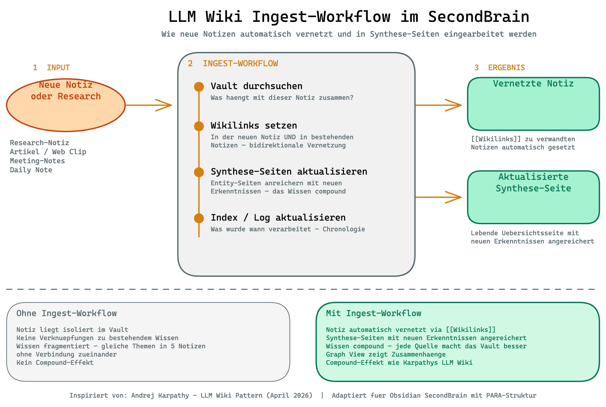

# Ingest Skill — SecondBrain Vernetzung

Verarbeitet Notizen im SecondBrain Obsidian Vault und vernetzt sie mit dem restlichen Wissen. Macht aus isolierten Notizen ein vernetztes Wissenssystem — inspiriert von Andrej Karpathys LLM Wiki Pattern.

**Der Kern:** Vorverarbeitung statt Echtzeit-Suche. Zusammenhaenge werden beim Ablegen hergestellt, nicht erst beim Abfragen. Claude findet Kontext sofort statt bei jeder Session das ganze Vault durchsuchen zu muessen.



## Version

**v1.0.0** (April 2026)

## Installation

```bash
cp -r ~/Documents/GitHub/secondbrain-setup/skills/ingest ~/.claude/skills/ingest
```

Pruefen ob es funktioniert:

```
/ingest
```

## Nutzung

| Aufruf | Verhalten |
|--------|-----------|
| `/ingest Notizname` | Verarbeitet die genannte Notiz |
| `/ingest /pfad/zur/notiz.md` | Verarbeitet die Notiz am Pfad |
| `/ingest` | Fragt welche Notiz verarbeitet werden soll |

Weitere Ausloeser: "verarbeite diese Notiz", "vernetze das", "integriere das ins Vault"

## Was der Skill tut (4 Schritte)

### 1. Vault durchsuchen

Die Quell-Notiz wird gelesen, Kernthemen extrahiert und das Vault nach verwandten Notizen durchsucht (per Grep, Glob und Tag-Abgleich). Ergebnis: Eine Liste aller Zusammenhaenge.

### 2. Wikilinks setzen (bidirektional)

- In der Quell-Notiz: `[[Wikilinks]]` zu verwandten Notizen
- In den verwandten Notizen: `[[Ruecklink]]` zur Quell-Notiz
- Bestehende Links werden nicht dupliziert
- Der Nutzer wird gefragt bevor Links gesetzt werden

### 3. Synthese-Seite aktualisieren (automatisch)

Der entscheidende Unterschied zur reinen Verlinkung:

- Prueft ob eine passende Synthese-Seite existiert (Start-Datei in `04 Ressourcen/`)
- Wenn ja: Destillierte Erkenntnisse aus der Notiz einarbeiten (keine Copy-Paste!)
- Wenn nein: Fragt ob eine neue Synthese-Seite angelegt werden soll
- Jede Synthese-Seite wird mit jeder neuen Quelle reicher — der **Compound-Effekt**

### 4. Log aktualisieren

Append-only Eintrag in `log.md`: Was wurde verarbeitet, welche Links gesetzt, welche Synthese-Seiten aktualisiert.

## Hintergrund: Warum dieser Skill?

### Das Problem

Das SecondBrain (PARA-Struktur) ist stark beim **Speichern und Ordnen**, aber schwach beim **Vernetzen und Synthetisieren**. Notizen liegen oft isoliert — gleiche Themen in 5 Notizen ohne Verbindung zueinander. Kein Compound-Effekt.

### Die Loesung (Karpathys LLM Wiki Pattern)

Andrej Karpathy beschreibt ein Pattern bei dem ein LLM ein strukturiertes Wiki inkrementell pflegt. Statt Wissen bei jeder Abfrage neu zusammenzusuchen, wird es beim Ablegen einmal verarbeitet und vernetzt. Das Wiki ist ein "persistent, compounding artifact".

### Was wir uebernommen haben

Nicht den kompletten Wiki-Ansatz (eigenes Verzeichnis, Schema-Layer), sondern drei Kern-Workflows integriert in die bestehende PARA-Struktur:

1. **Ingest** — Dieser Skill. Vernetzt neue Notizen und aktualisiert Synthese-Seiten.
2. **Lint** — Woechentlicher Gesundheits-Check (separater Skill, siehe [`../lint/`](../lint/)).
3. **Synthese** — Teil des Ingest-Workflows, kein eigener Skill.

### Der Performance-Gewinn

| Ohne Ingest | Mit Ingest |
|-------------|-----------|
| Claude durchsucht das ganze Vault | Zusammenhaenge sind als Wikilinks da |
| Kostet Tokens bei jeder Session | Einmalige Vorverarbeitung |
| Findet nicht alle Zusammenhaenge | Bidirektionale Links + Synthese |
| Kein Compound-Effekt | Jede Quelle macht das Vault besser |

## Regeln

1. **IMMER fragen** bevor Links gesetzt oder Notizen veraendert werden
2. **NIE loeschen** — bestehende Inhalte werden nur ergaenzt
3. **NIE duplizieren** — Links werden vor dem Setzen geprueft
4. **Synthese ≠ Copy-Paste** — destillierte Erkenntnis in eigener Formulierung
5. **Log ist append-only**
6. **07 Anhaenge/ wird ignoriert**

## Dateistruktur

```
ingest/
├── SKILL.md                         <- Skill-Logik (Workflow, Regeln)
├── README.md                        <- Diese Datei
├── diagram-ingest-workflow.excalidraw <- Workflow-Diagramm (Excalidraw)
└── diagram-ingest-workflow.png       <- Workflow-Diagramm (gerendert)
```

## Quellen

- [Karpathy LLM Wiki Gist](https://gist.github.com/karpathy/442a6bf555914893e9891c11519de94f)
- Komplementaerer Skill: [`../lint/`](../lint/) — woechentlicher Vault-Gesundheits-Check
